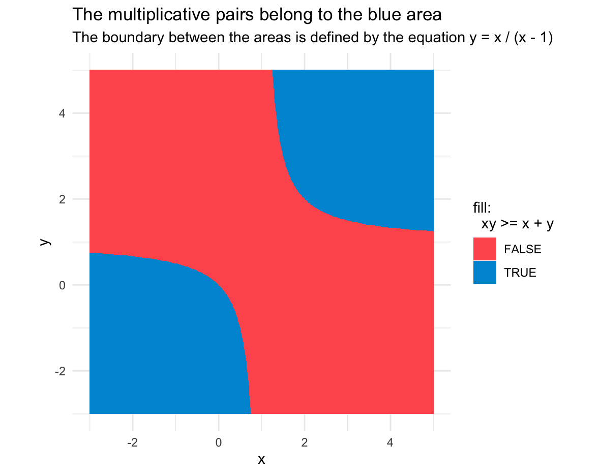
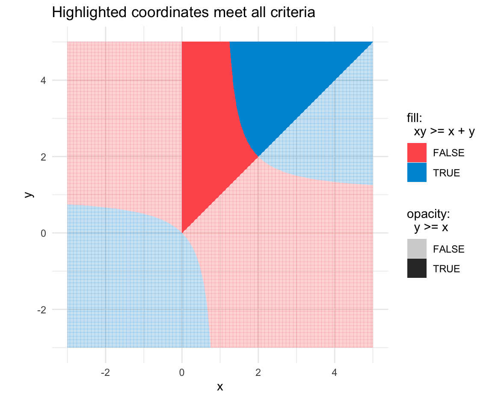
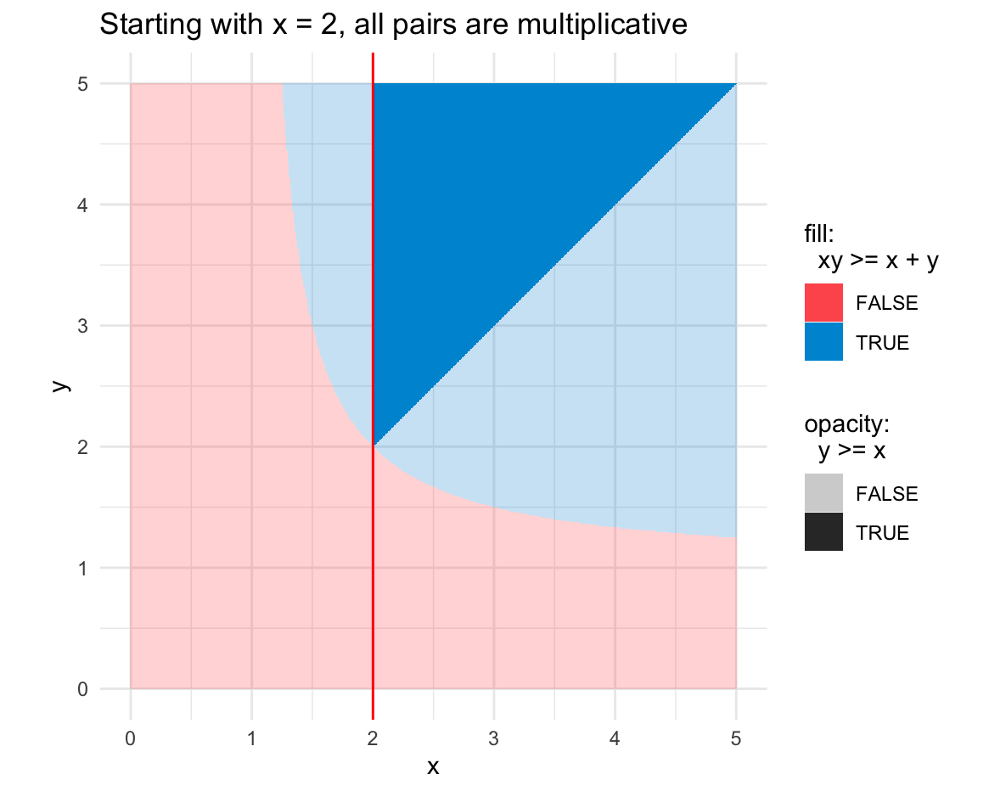
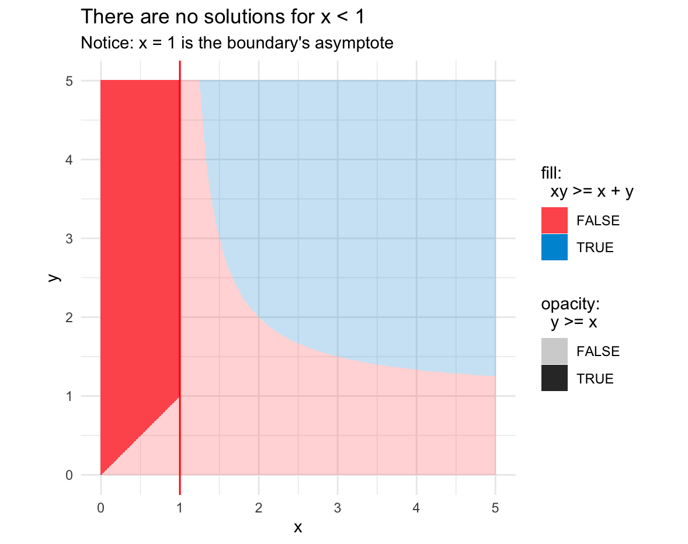
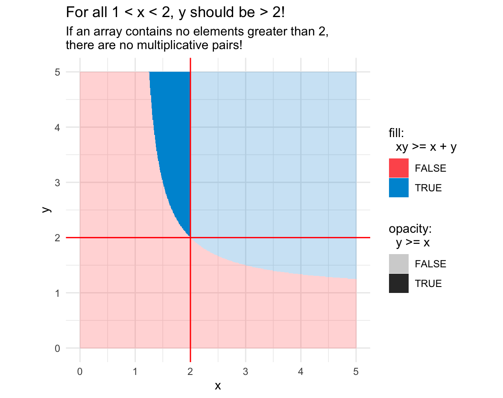
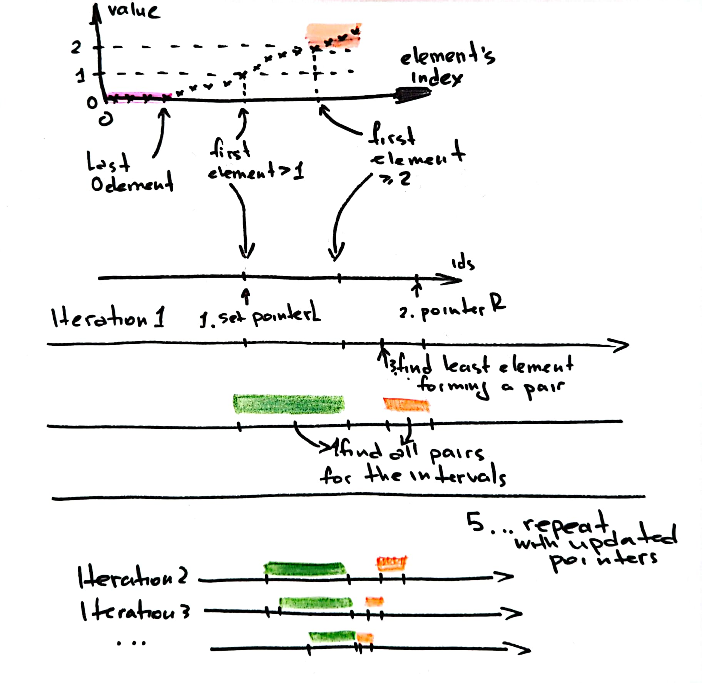

# Finding ~~Nemo~~ Multiplicative Records

## Problem Definition

Given an array of non-negative numbers, find the number of multiplicative pairs (x, y) in it.

We call a pair "multiplicative" if the product of its elements is not less than their sum.

Requirements:

- $id(x) < id(y)$ - element y **always** goes after x in the array
- $x <= y$ - all elements in the array are sorted in non-decreasing order
- $x * y >= x + y$ - this condition defines if a given pair is multiplicative

## Explorations, Explanations, and Solution

Let's start with plotting such pairs on a plane.

All the points (x, y) inside the blue areas meet the condition and
represent multiplicative pairs.

> Note: The boundary between the areas is defined by an equation $y = x / (x - 1)$.

But not all points on the graph meet our requirements:
some are negative, others have reversed order.
We can actually define the solution space by applying all those requirements.

### Special cases

If we look closer, we can notice several special cases.

#### x = 0, y = 0

First, for the lower blue area.
All its solutions require at least one element to be negative.
All but one, (0, 0).

This will be our first special case.

#### x >= 2

Now, to the upper area. We know that $y >= x$, always.

With this knowledge, we can play around with the inequality.

- if $y >= x$, then $y + y >= x + y$
- if $xy >= y + y$, then $xy >= x + y$ as well
- if $xy >= 2y$, then $x >= 2$

That means, for **any** $x >= 2$, **any** $y >= x$ builds a proper multiplicative pair.

Check the graphical proof:

#### 0 < x < 1

As soon as x = 1 is the boundary's asymptote,
the whole upper blue area is laying on the left of it.

That means, in this interval we cannot find any proper pairs. Never.

#### 1 < x < 2

This is the most interesting case. For all xs from this interval, we need to find
corresponding ys.

But let's put some additional boundaries there:

As you see, for all $x$ here all **$y$ should be greater than 2**.

What does it mean to us? If an array contains no elements grater than zero,
there are no pair siblings for $1 < x < 2$.

Also, we are able to find the minimal $y$ meeting the criteria: $y_{min} = x / (x - 1)$.
(Yes, this is a boundary condition.)

Any $y >= y_{min}$ will create a proper multiplicative pair with that $x$.

#### Summarize the Findings

To sum up, this is what we discovered to be a (non-)solution:

- all $(0, 0)$ elements build pairs
- for all $x >= 2$, any $y$ builds a pair
- for all $1 < x < 2$, we can find $y_{min}$ after which all pairs are valid
- there are no possible pairs for $0 < x < 1$

## Implementation and Optimizations

The development is done in 2 steps:

1. Implement a bruteforce solution (just following the task description)
   and add corresponding test
2. Find a more optimal solution while comparing its results against the bruteforce one
   for any input

To compare two solutions, we implemented a property-based test
[check `test_solutions_properties.py`](../test_solutions_properties.py).
For each testing round, it generates arbitrary inputs of varied lengths,
passes them into two functions and compares their outputs.

From a higher view, the solution is 3-part:

1. Find the index of the last 0 element. Compute the number of pairs and add to the `count`.
2. Find the index of the first element that is greater than 2. 
Compute the number of pairs and add it to the `count`. 
Set this index to the `at_least_two_min_index` variable. 
3. Find all the pairs for x between 1 and 2 as described below

The main question is: how to efficiently find these pairs for $1 < x < 2$?

### Introduce pointers

The solution is based on tracking elements' indices. 

1. Find the index of a minimal element between 1 and 2 that may have a valid pair.
Set the `left_pointer` there.

2. Set the `right_pointer` to the last element in the array.

3. For every element between the `left_pointer` and `at_least_two_min_index`:
   1. find the index of the least element that builds a pair with it 
   2. compute the number of valid pairs and add it to the total `count`
   3. set the `right_pointer` to the previous element
   4. repeat until convergence: either `left_pointer` or `right_pointer`
      reaches `at_least_two_min_index`

Please check the graphical interpretation of the algorithm:

